# **LLM-Powered Chatbot API for Document Querying and Database Interaction**

A project developed in collaboration with **NeuroTechR3**, designed to integrate an **AI-driven chatbot** to assist users in querying documents and retrieving personalized data from a **NoSQL database**. This chatbot is part of the **R3THA neurorehabilitation platform**, aiding users in their rehabilitation journey by **automating responses, troubleshooting setup issues, and retrieving progress metrics** dynamically.

## Note

This repository contains the details and documentation of the project I worked on in collaboration with NeuroTechR3 company. Due to confidentiality and privacy policies, I am unable to share the source code publicly. However, I have provided insights into the project's architecture, design, and implementation approach.

## **Project Overview**

### **Focus on Flask API Development**  
The core objective of this project was to design and implement a **Flask-based API** that powers the chatbot's document querying and database interaction capabilities. The API handles **query classification, retrieval (RAG and NoSQL), response generation, and visualization** efficiently.  

While a **React-based frontend** was created to test and interact with the chatbot, its primary purpose was to validate the API's functionality rather than serve as a production-ready UI. The emphasis remained on building a **scalable, secure, and efficient backend** that could seamlessly integrate into the **R3THA neurorehabilitation platform**.

### **Objectives**
The primary goal of this project is to develop an **intelligent chatbot** that can handle:
- **Document-based queries** (FAQs, manuals, troubleshooting)
- **User-specific database queries** (fetching rehabilitation progress data)
- **Graphical representation** of progress data (automated graph generation)
- **Secure API access** for seamless integration with R3THA

### **Key Challenges Addressed**
✅ Reducing **manual support overhead** by automating FAQs  
✅ Improving **user engagement** with an interactive chatbot  
✅ Enabling **real-time retrieval of rehabilitation data**  
✅ Providing **visual insights** through dynamically generated graphs  
✅ Ensuring **scalability and security** using cloud-based deployment  

---

## **Tech Stack**
| Component | Technology Used |
|-----------|----------------|
| **Backend** | Flask (Python), OpenAI API, LangChain |
| **Frontend** | React, Deep-Chat-React |
| **Database** | MongoDB Atlas (NoSQL) |
| **Vector Storage** | Pinecone (Vector DB for RAG) |
| **Hosting** | AWS EC2, S3, RDS |
| **APIs** | RESTful APIs (Flask) |
| **Graphing** | Matplotlib (Dynamic Graphing) |

---

## **Project Architecture**
### **System Workflow**
1. **User Query Processing**
   - Users interact with the chatbot through a frontend interface.
   - The chatbot processes the query using an **LLM-powered contextualizer** to maintain conversation flow.

2. **Query Classification**
   - The system determines whether the query is a **document-based query** (RAG) or a **database query** (NoSQL retrieval).

3. **Data Retrieval & Processing**
   - If document-based, the system retrieves relevant content using **Pinecone Vector DB**.
   - If database-based, it converts the query into a **MongoDB aggregation query** using a custom-built **NoSQL agent**.

4. **Response Generation**
   - The chatbot returns a **text response** or a **graph (if required)** using **Matplotlib**.

5. **Final Output**
   - The response is displayed in the chatbot interface.

### **Architecture Diagram**
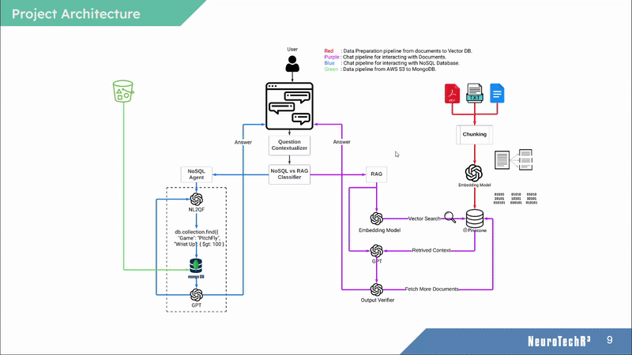
---

## **Data Flow**
### 1. **Query Routing Mechanism**
- The **NoSQL vs RAG Classifier** determines whether the query should be handled by the **Knowledge Base (RAG)** or **Database (MongoDB)**.

### 2. **RAG-Based Document Retrieval**
- Documents (FAQs, manuals) are stored in **Pinecone Vector DB**.
- When queried, relevant document chunks are **retrieved and processed using GPT-4o**.

### 3. **NoSQL Query Execution**
- User-specific queries are **converted into MongoDB queries**.
- Retrieved data is either **displayed as text** or **visualized as a graph**.

### **Data Flow Diagram**
 
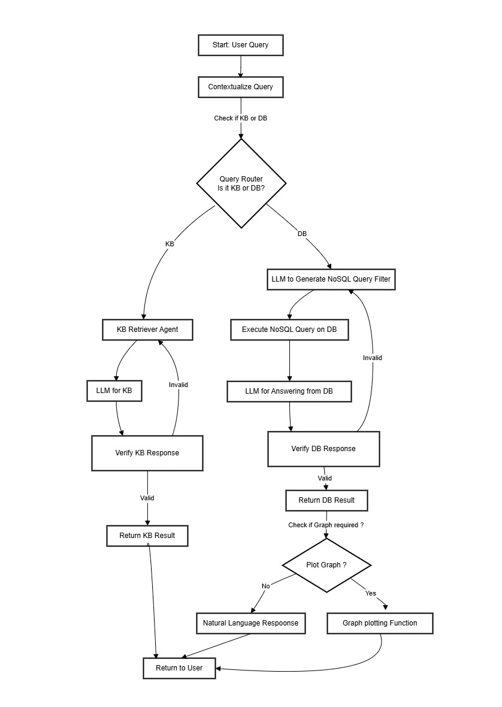
---


---

## **API Documentation**
### 1. **Chatbot API**
- **Endpoint:** `/llm/query/`
- **Method:** `POST`
- **Request Format:**
  ```json
  {
    "message": "How do I set up my Ultraleap device?"
  }
  ```
- **Response Format:**
  ```json
  {
    "output": "To set up your Ultraleap device, follow these steps..."
  }
  ```

### 2. **User Login API**
- **Endpoint:** `/llm/login/`
- **Method:** `POST`
- **Request Format:**
  ```json
  {
    "username": "user1",
    "password": "password123"
  }
  ```
- **Response Format:**
  ```json
  {
    "status": "success",
    "message": "User logged in successfully"
  }
  ```

### 3. **File Upload API (Admin Only)**
- **Endpoint:** `/llm/upload/`
- **Method:** `POST`
- **Request Format:** (Use form-data to upload a PDF)
- **Response Format:**
  ```json
  {
    "message": "File uploaded successfully"
  }
  ```

---

## **Screenshots**


### **Project Structure**

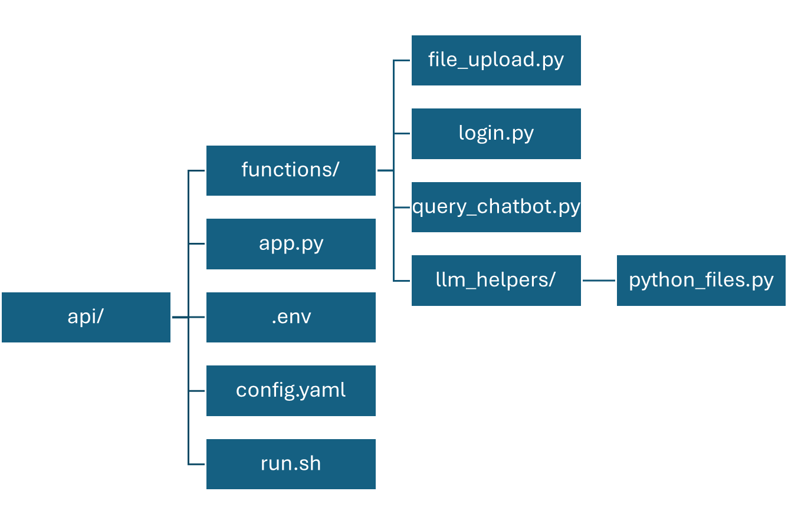
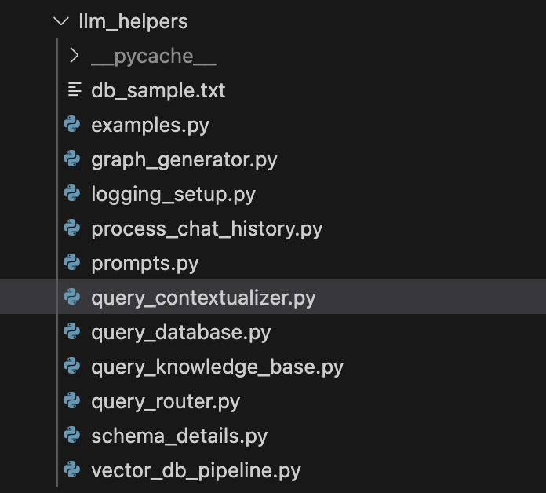

### **API Response (Postman)**  
Below is a screenshot of a sample Postman request and response of the API. The screenshot shows the first message with the chatbot, where the user’s message is “hi”.

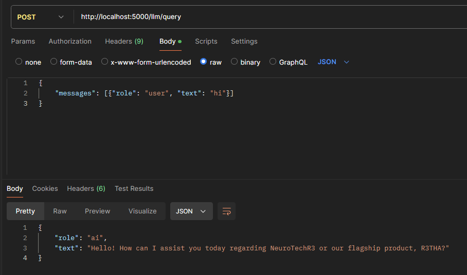

The next screenshot shows the knowledge base of the chatbot being queried. It also shows how the previous messages are sent in the POST request of the API.


The following screenshot shows the response to the user when the API generates a visualization as its response. The visualization is encoded in base64 in png format and returned to the user.

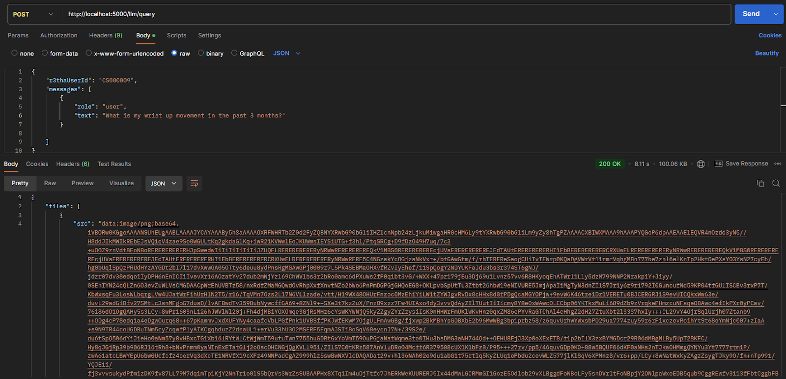

### **Admin Upload Page**  

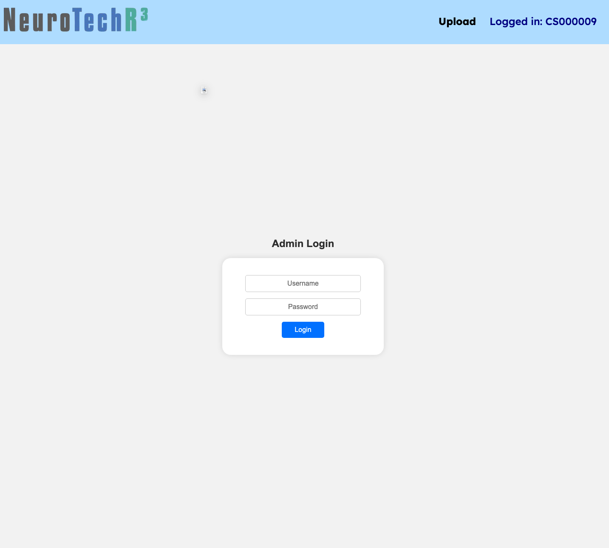
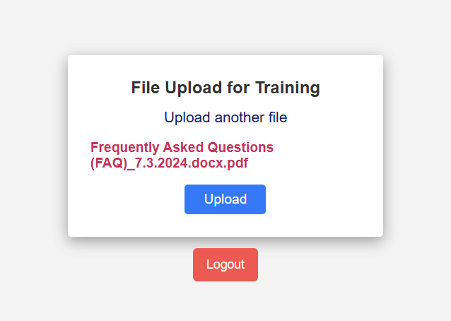

### **Chatbot UI**  

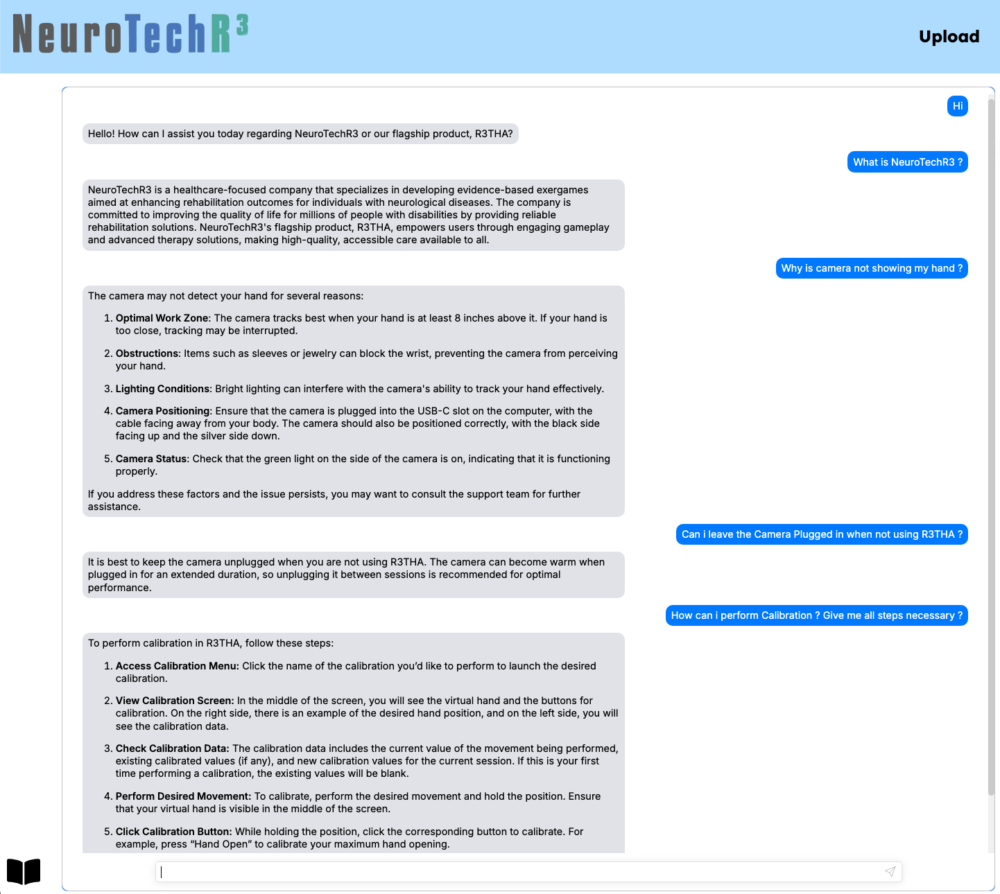

### **Graph Generated from Database Query**  

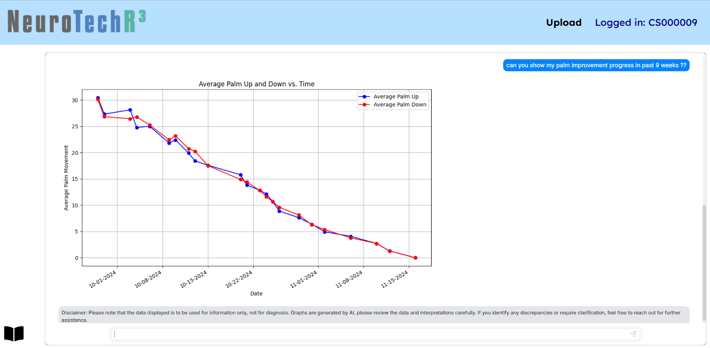
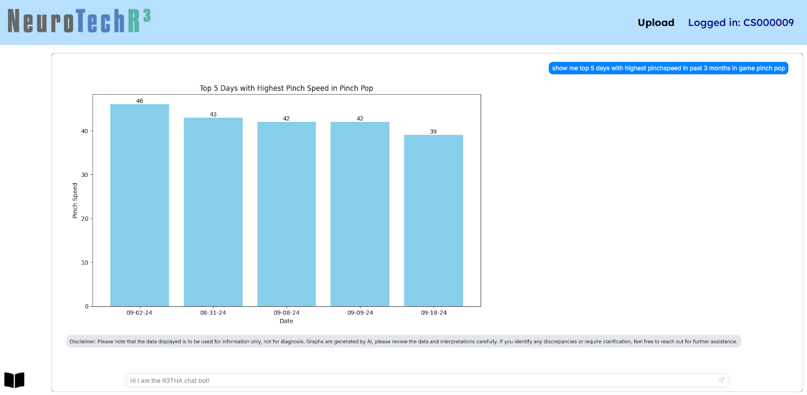


---

## **Testing & Evaluation**
### 1. **Verification Strategies**
- **Manual Testing:** Predefined user queries were tested.
- **LangSmith Logs:** Used to validate LLM responses.
- **Database Query Validation:** Cross-checked responses against expected values.

### 2. **Accuracy Checks**
- Verified chatbot responses with **actual database values**.
- Ensured **graph responses** matched expected patterns.

### 3. **Security Measures**
✅ **Flask API secured with HTTPS**  
✅ **Role-based access for admins**  
✅ **Authentication for user-specific queries**  

---

## **References**
- **NeuroTechR3 Official Documentation**
- **LangChain Docs** - [LangChain](https://python.langchain.com/)
- **OpenAI API** - [OpenAI](https://platform.openai.com/)
- **MongoDB Aggregation Framework** - [MongoDB Docs](https://www.mongodb.com/docs/manual/aggregation/)

---

## **Conclusion**
This **LLM-powered chatbot** successfully integrates **document querying, NoSQL interaction, and AI-powered graphing**, making R3THA’s rehabilitation process **simpler and more efficient** for users. 🚀

